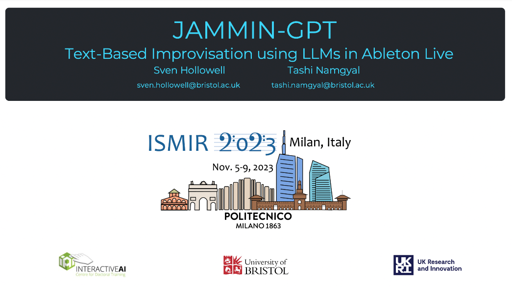

# JAMMIN-GPT
[**Paper**](https://arxiv.org/pdf/2312.03479.pdf) | [**ISMIR Poster**](https://ismir2023program.ismir.net/lbd_356.html) 

### Requirements
- abc2midi - https://abcmidi.sourceforge.io/
    - `brew install abc2midi`
    - if not installed using homebrew set path here: 
https://github.com/supersational/JAMMIN-GPT/blob/main/generate_midi.py#L15
- pip install openai>=1.1.1 rtmidi mido==1.3.0
- place 'client' folder in Ableton's Remote Scripts folder
(for me it's in `/Users/sven/Music/Ableton/User Library/Remote Scripts/AbletonOSC/client/`)

### Optional Requirements:
- fluidsynth (to use GM soundfonts)
    - run fluidsynth and select it as an output MIDI device in Ableton with 1 channel per track
    - `fluidsynth path_to_soundfont/FluidR3_GM.sf2 -pFluidSynth` is the command I use

### Screenshot

### Add AbletonOSC as a control surface in Ableton

